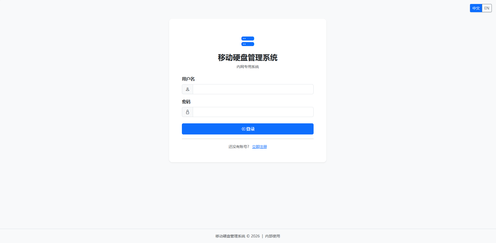
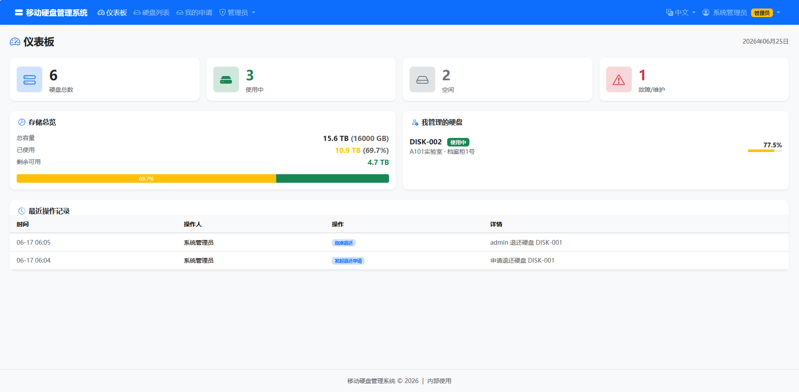
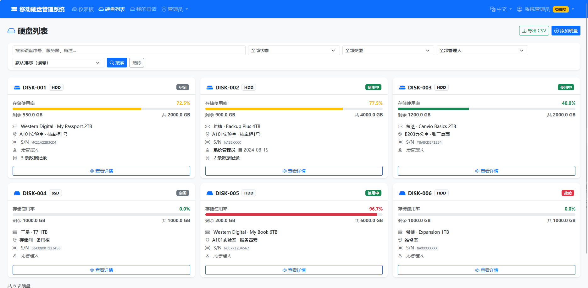
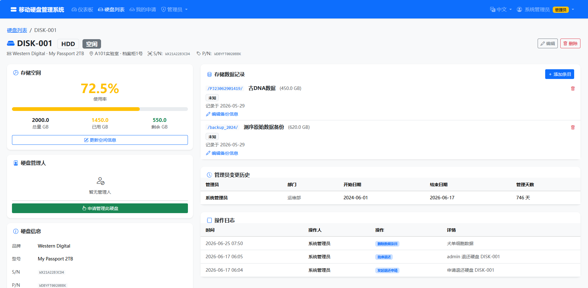
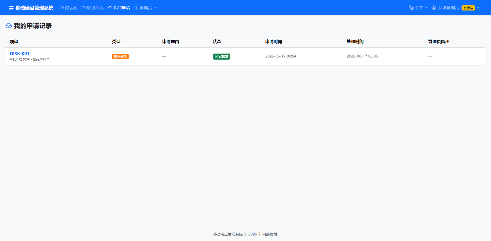
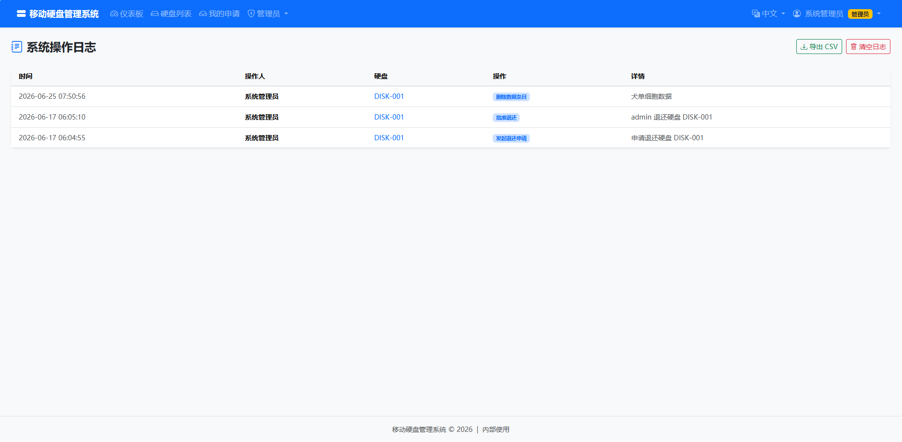

# 移动硬盘管理系统 / Portable Disk Management System

**[中文](#中文说明) | [English](#english)**

基于 Flask + SQLite 的内网硬盘管理 Web 应用，适合超算中心、实验室等需要集中管理多块移动硬盘的场景。

> A self-hosted web app for managing portable/external disks in HPC labs. Built with Flask + SQLite, supports Chinese / English UI.

---

## 截图 / Screenshots

<!-- 把截图放到 screenshots/ 文件夹后，取消下面几行的注释 -->







---

## 中文说明

### 功能列表

- **硬盘管理**：编号、类型（HDD/SSD/NVMe）、总容量/已用/剩余、状态、物理位置
- **管理人系统**：每块硬盘指定管理人，记录开始管理日期
- **申请流程**：用户发起申请 → 管理员审批 → 自动交接管理权
- **数据记录**：每块硬盘可添加多条数据（描述、路径、大小、备份状态）
- **仪表板**：总览统计、全局存储使用率、待审批提醒
- **搜索筛选**：按编号/状态/类型/管理人筛选
- **导出 CSV**：一键导出所有硬盘或审计日志
- **管理员功能**：添加/编辑/删除硬盘、用户角色管理、操作审计日志
- **历史记录**：管理员变更历史、完整操作日志
- **多语言**：支持中文 / English 切换（页面右上角）

### 快速开始

**1. 安装依赖**

```bash
pip install -r requirements.txt
```

**2. 启动服务**

```bash
python app.py
```

默认监听 `0.0.0.0:5000`，内网所有机器均可访问：`http://<服务器IP>:5000`

**3. 默认管理员账户**

| 用户名 | 密码      |
|--------|-----------|
| admin  | admin123  |

> ⚠️ 首次登录后请立即在「修改密码」页面更换密码。

### Linux 服务器部署

```bash
# 安装依赖
pip install -r requirements.txt

# 后台运行
nohup python app.py > disk_manager.log 2>&1 &

# 或使用 gunicorn（推荐生产环境）
pip install gunicorn
gunicorn -w 2 -b 0.0.0.0:5000 app:app
```

### 修改端口

编辑 `app.py` 最后一行：

```python
app.run(host='0.0.0.0', port=5000, debug=False)
```

将 `5000` 改为所需端口号。

---

## English

### Features

- **Disk management**: ID, type (HDD/SSD/NVMe), capacity, usage, status, physical location
- **Manager system**: Each disk has an assigned manager with start date tracking
- **Request workflow**: User submits request → Admin approves → Manager auto-reassigned
- **Data records**: Add multiple data entries per disk (description, path, size, backup status)
- **Dashboard**: Overview stats, global storage usage, pending approval alerts
- **Search & filter**: Filter by ID / status / type / manager
- **CSV export**: Export disk list or audit logs
- **Admin panel**: Add/edit/delete disks, user role management, full audit log
- **History**: Complete manager change history and operation log
- **Bilingual UI**: Switch between Chinese and English (top-right corner)

### Quick Start

```bash
# Install dependencies
pip install -r requirements.txt

# Run
python app.py
```

Access at `http://<server-ip>:5000`

Default admin credentials: **admin / admin123** — change immediately after first login.

---

## 技术栈 / Tech Stack

| | |
|---|---|
| 后端 / Backend | Python 3.8+ / Flask 3.x |
| 数据库 / Database | SQLite（自动创建） |
| 前端 / Frontend | Bootstrap 5.3 + Bootstrap Icons |
| 认证 / Auth | Flask Session + Werkzeug password hashing |

## 目录结构 / Project Structure

```
disk_manager/
├── app.py                  # 主应用 / Main application
├── i18n.py                 # 多语言翻译 / Translations (zh/en)
├── requirements.txt
├── templates/
│   ├── base.html
│   ├── login.html
│   ├── register.html
│   ├── dashboard.html
│   ├── disks.html
│   ├── disk_detail.html
│   ├── my_requests.html
│   ├── change_password.html
│   └── admin/
│       ├── requests.html
│       ├── add_disk.html
│       ├── edit_disk.html
│       ├── users.html
│       └── audit.html
└── static/
    ├── css/style.css
    └── js/main.js
```

## License

MIT License — free to use, modify and distribute.
